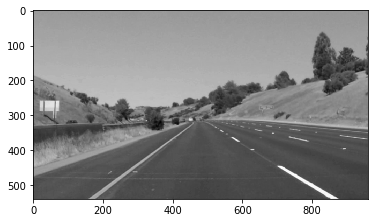
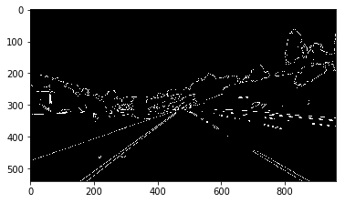
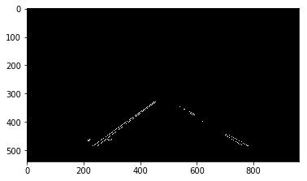
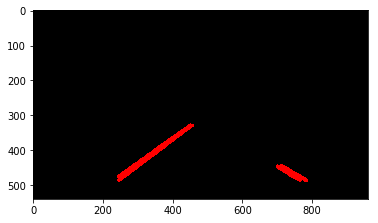
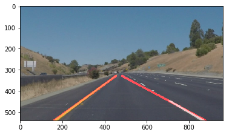

# **Finding Lane Lines on the Road**

---

**Finding Lane Lines on the Road**

The goals / steps of this project are the following:
* Make a pipeline that finds lane lines on the road
* Reflect on your work in a written report

---

### Reflection

### 1. Describe your pipeline. As part of the description, explain how you modified the draw_lines() function.

- **Pipeline**
My pipeline consisted of 5 steps.
 1. Convert the images to grayscale because lane markings could be in different colors.
 1. Apply Gaussion Smoothing to image. The kernel size must not be too big to blur the edges out. The kernel size must not be too small to contain big gradients all over the image.
 1. Use Canny Edge Detector to increase contrsat and remove noise.
 1. Apply Region Selection as lane markings usually appear at the same region of camera view.
 1. Apply Hough Transform to find connected lines. Parameters must be tuned to only keep long contineous lines which are more likely to be lane markings.

 Output of each step in my pipeline
 - Grayscale
 
 - Gaussian Smoothing
 
 - Canny Edge
 
 - Regsion Selection
 
 - Hough Transform
 

- **Draw Line**
In order to draw a single line on the left and right lanes, I modified the draw_lines() function by picking the segment that best fits all endpoints. `numpy.linalg.lstsq` is employed to find the segment with least squared error. [1]

 - Output of averaged segments

### 2. Identify potential shortcomings with your current pipeline

The potential shortcomings with current pipeline are

1. If camera is installed at different heights or with a different angle, the selected region needs to be adjusted.
1. Cracks on the road surface may be classied as lane marking provided the slope is within threshold
1. When driving on curved road or making turns, lane marking may not be straight lines.
1. When driving under different lighting/weather conditions, contrast between lane marking and road surface might be too low in some frames. Consequently no lane marking will be identified.
1. There might be multiple lanes markings when the vehicle is changing lanes/merging

### 3. Suggest possible improvements to your pipeline

To mitigate/resolve the potentional shortcommings, the following approaches could be considered.
1. Inform driver to adjust camera position or selected region if lane marking couldn't be detected on known roads.
1. Most lane markings are in white/yellow. This feature could be employed to filter out more false positives.
1. When driving on curved path, use yaw rate to adjust selected region and slope thresholds.
1. In case lane marking couldn't be detected (when driving in shadow or through an intersection) or wobbly (unstable average slope), use the running average of the last X frames.
1. When the road does not have lane marking, detect the edges of road to predict virtual lane markings.

### 4. References
[1] https://docs.scipy.org/doc/numpy/reference/generated/numpy.linalg.lstsq.html